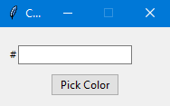

# Pick a color

Select the color of a pixel on your screen by clicking 'Pick color'. Position your cursor over the pixel and click the a mouse button. 

Automatically copies the selected color to clipboard.

# Install

## Create virtual environment

``
python -m venv venv
``

## Activate the virtual environment (on Windows)

``
.\venv\Scripts\activate
``

## Install dependencies

``
pip install -r requirements.txt
``

# Create exe

``
python.exe -m PyInstaller --onefile --noconsole ColorPicker.py ``